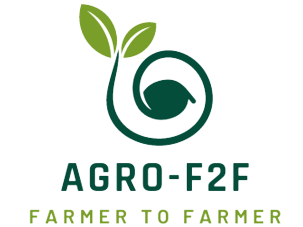

<h1 align="center">
  
</h1>

Table of Contents

- [About](#about)
  - [Motive](#Motive)
- [Tech Stack](#tech-stack)
- [tools](#tools)
- [view](#view)

---

## About

<table>
<tr>
<td>

AGRO- F2F, is a unique space that connects the entire
farmer community with investors. We are committed to
provide a comprehensive platform for farmers to showcase
their innovative ideas, raise funds, sell their agricultural
products, and share their knowledge and experience with
other farmers.

Our platform is designed to empower farmers by providing
them access to an extensive library of resources and
information on agriculture, helping them to implement new
techniques and practices in their fields

Problems to be solved through this platform:

- There are farmers having proper Land areas and skills
but due to lack of money they cannot continue farming
- Presently not all farmers are updated with latest
technological innovations that are coming in the
market and still uses that traditional methods of
farming.
- Presently, Farmers works individually , his/her
connections is limited to his locals only . This becomes a
hinderance to his Learings.

 

</td>
</tr>
</table>

### 💻 Tech Stack:

&nbsp;
&nbsp;
&nbsp;
&nbsp;
&nbsp;
&nbsp;

### 🛠 Tools:

&nbsp;
&nbsp;
&nbsp;
